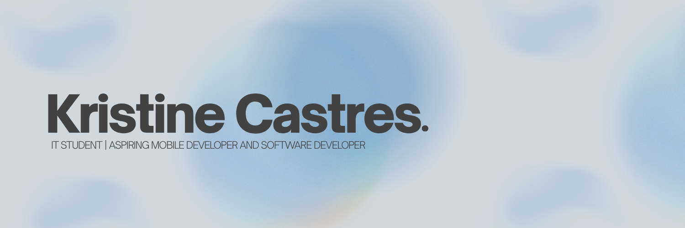

# Hi, I'm Kristine Castres

**IT Student | Software & Mobile Development**

I'm an Information Technology student interested in building practical applications and improving user experiences through software development.

I enjoy working on **web and mobile applications**, exploring different technologies, and turning ideas into functional projects.

## Tech Stack

### Familiar With

  

### Currently Learning

  

## What I'm Looking For

I'm currently looking for **IT internship opportunities** where I can gain real-world development experience, contribute to projects, and continue improving my technical skills.

## Connect With Me

  
  

